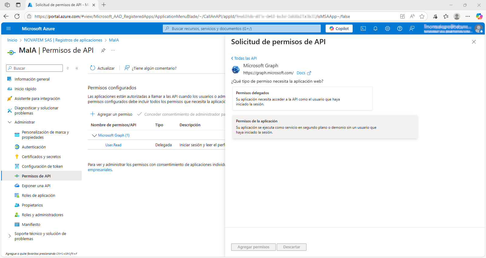

# MaIA Concept

## Descripción General

**MaIA Concept** es una plataforma conversacional diseñada para integrarse con **Microsoft Teams** y ofrecer un asistente inteligente que centraliza la interacción entre empleados, documentos corporativos y modelos de lenguaje avanzados.  

El sistema combina las capacidades de **Microsoft Graph API**, **OpenAI** y **SharePoint**, proporcionando un bot con autenticación segura, permisos personalizados y una arquitectura modular basada en *handlers*.  

Con **MaIA Concept**, las organizaciones pueden:  
- Automatizar la consulta y gestión de documentos.  
- Brindar soporte inteligente a los usuarios a través de modelos de lenguaje natural.  
- Gestionar permisos, usuarios y roles directamente desde Teams.  
- Ofrecer un acceso centralizado a la información corporativa con trazabilidad y registro de uso.  

En resumen, esta aplicación actúa como un **hub inteligente** dentro de Teams, potenciando la productividad y garantizando un acceso controlado a la información.

---

## Capacidades Principales

El bot está construido sobre un sistema de **handlers modulares**, lo que permite extender sus capacidades de manera organizada y escalable. Actualmente, las principales funcionalidades incluyen:

### Gestión Administrativa
- Administración de usuarios (añadir, eliminar, cambiar roles).  
- Listado de usuarios autorizados y miembros de un chat de Teams.  
- Control de permisos y auditoría de comandos.  

### Asistente LLM
- Interacción con un **modelo de lenguaje de OpenAI** para responder preguntas generales.  
- Ejecución de comandos especializados con plantillas predefinidas:  
  - `translate`: traducción de texto.  
  - `medic`: soporte en lenguaje médico.  
  - `email`: redacción de correos profesionales.  
- Memoria conversacional persistente para mantener contexto.  

### RAG (Retrieval-Augmented Generation)
- Respuestas enriquecidas con información corporativa almacenada en **Vector Stores** de OpenAI.  
- Soporte para múltiples dominios de conocimiento (ej. SGC, documentación técnica).  
- Integración con búsqueda contextualizada en archivos.
- Memoria conversacional persistente para mantener contexto. 

### Sincronización de Documentos
- Monitorización continua de carpetas configuradas en **SharePoint**.  
- Sincronización automática con **Vector Stores de OpenAI**:  
  - **Creación** → documentos nuevos se indexan.  
  - **Modificación** → los cambios se actualizan en el índice.  
  - **Eliminación** → los documentos se eliminan de la Vector Store.  
- Garantiza que las consultas basadas en RAG estén siempre respaldadas con la información más reciente.  

### Gestión de Archivos
- Consulta de documentos a través de códigos únicos (ejemplo: `FR-GC-01`). 
- Acceso rápido a documentos frecuentes y plantillas comunes.  

### Soporte y Ayuda
- Generación dinámica de ayuda sobre comandos disponibles.  
- Información específica por handler según los permisos del usuario.  

### Conexión con SharePoint
- Autenticación con OAuth 2.0 vía Azure AD.  
- Navegación por sitios, bibliotecas y carpetas.  
- Obtención de archivos y metadatos (nombre, tipo, tamaño, fechas).  

### Monitoreo y Estadísticas
- Registro centralizado de eventos y logs de usuario.  
- Métricas de uso: tiempos de respuesta, éxito/errores, frecuencia de comandos.

---

## Requisitos del Sistema

Para el correcto funcionamiento de la aplicación es necesario contar con las siguientes dependencias instaladas en el sistema:

- **Python 3.10+** (recomendado).  
- **LibreOffice**: requerido para la conversión de documentos de Office (ej. `.docx`, `.pptx`, `.xlsx`) a formatos procesables por la aplicación antes de generar embeddings en la Vector Store.  

LibreOffice: [https://www.libreoffice.org/download/](https://www.libreoffice.org/download/)

> ⚠️ Si LibreOffice no está instalado, la aplicación no podrá procesar correctamente algunos documentos durante la sincronización con la Vector Store.

---

## Configuración y Variables de Entorno (.env)

Este archivo contiene las variables de entorno necesarias para la configuración y el funcionamiento de la aplicación.

### 1. Configuración del Servidor

| **Variable** | **Descripción** | **Ejemplo** | **Notas** |
|--------------|-----------------|-------------|-----------|
| `HOST` | Define la dirección IP en la que el servidor escuchará las peticiones. | `0.0.0.0` | `0.0.0.0` permite que el servidor sea accesible desde cualquier interfaz de red. |
| `PORT` | Especifica el puerto en el que se ejecutará el servidor de la aplicación. | `3978` | Asegúrate de que el puerto no esté en uso por otra aplicación. |

### 2. Configuración de Autenticación

| **Variable** | **Descripción** | **Ejemplo** | **Notas** |
|--------------|-----------------|-------------|-----------|
| `DEFAULT_ADMIN_USER_ID` | ID de teams del usuario administrador por defecto. Formato: `^[0-9]{2}:[a-z0-9_-]{87}$` | `xx:xx...xxx` | Necesario para identificar al administrador principal en la aplicación. |
| `DEFAULT_ADMIN_NAME` | Nombre del usuario administrador por defecto. | `Juan Pérez` | Utilizado para mostrar el nombre del administrador. |
| `DEFAULT_ADMIN_EMAIL` | Correo electrónico del usuario administrador por defecto. | `admin@babynova.com` | Se utiliza para notificaciones o identificación. |

### 3. Configuración del Bot de Microsoft Teams

| **Variable** | **Descripción** | **Ejemplo** | **Notas** |
|--------------|-----------------|-------------|-----------|
| `APP_ID` | ID de la aplicación (cliente) registrada en Azure Active Directory para tu bot de Teams. Formato: `^[a-zA-Z0-9]{8}-[a-zA-Z0-9]{4}-[a-zA-Z0-9]{4}-[a-zA-Z0-9]{4}-[a-zA-Z0-9]{12}$` | `xxxxxxxx-xxxx-xxxx-xxxx-xxxxxxxxxxxx` | Obtén este valor desde el registro de tu aplicación en Azure. |
| `APP_TENANT` | ID del directorio (inquilino) de Azure Active Directory al que pertenece tu aplicación. Formato: `^[a-zA-Z0-9]{8}-[a-zA-Z0-9]{4}-[a-zA-Z0-9]{4}-[a-zA-Z0-9]{4}-[a-zA-Z0-9]{12}$` | `xxxxxxxx-xxxx-xxxx-xxxx-xxxxxxxxxxxx` | Es el ID de tu organización en Azure. |
| `APP_PASSWORD` | Secreto del cliente (contraseña) generado para tu aplicación en Azure. Formato: `^[a-zA-Z0-9~]{40}$`| `xxxxxxxxxxxxxxxxxxxxxxxxxxxxxxxxxxxxxxxx` | Se genera en la sección "Secretos y certificados" de tu aplicación. ¡Manténlo seguro! |

### 4. Configuración de Carpetas de Microsoft SharePoint

| **Variable** | **Descripción** | **Ejemplo** | **Notas** |
|--------------|-----------------|-------------|-----------|
| `SITE_URL` | URL relativa del sitio de SharePoint donde se almacenan los documentos. | `[YourSharePointTenant].sharepoint.com:/sites/[YourSharePointSiteName]` | Asegúrate de que la ruta sea correcta y accesible. |
| `SITE_ID` | ID completo del sitio de SharePoint. | `[YourSharePointTenant].sharepoint.com,[SiteColectionID],[WebID]` | Este ID identifica de forma única el sitio. |
| `DRIVE_ID` | ID de la biblioteca de documentos (Drive) dentro del sitio de SharePoint. Formato: `^b![a-zA-Z0-9_-]{64}$`  | `b!xx...xxx` | Cada biblioteca tiene un ID único. |
| `FOLDER_ID` | ID de la carpeta específica dentro de la biblioteca de documentos de SharePoint. Formato: `^[a-zA-Z0-9]{34}$` | `xxxxxxxxxxxxxxxxxxxxxxxxxxxxxxxxxx` | Identifica la carpeta donde se interactuarán los archivos. |

### 5. Configuración de la API de OpenAI

| **Variable** | **Descripción** | **Ejemplo** | **Notas** |
|--------------|-----------------|-------------|-----------|
| `OPENAI_API_KEY` | Clave de API para acceder a los servicios de OpenAI. Formato: `^sk-[a-zA-Z0-9-]{164}$` | `sk-xx...xxx` | ¡Extremadamente sensible! Nunca la compartas ni la expongas públicamente. |
| `OPENAI_ASSISTANT_ID` | ID del asistente específico de OpenAI que la aplicación utilizará. Formato: `^asst_[a-zA-Z0-9]{24}$	` | `asst_xxxxxxxxxxxxxxxxxxxxxxx` | Identifica al asistente con el que se interactuará. |
| `OPENAI_VECTOR_STORE_ID` | ID del almacén vectorial (Vector Store) de OpenAI. Formato: `^vs_[a-zA-Z0-9]{32}$` | `vs_xxxxxxxxxxxxxxxxxxxxxxxxx` | Utilizado para almacenar y recuperar embeddings o datos vectoriales. |

---

## Crear y Registrar el Bot en Microsoft Teams

Para que el bot funcione correctamente en **Microsoft Teams**, primero es necesario **registrar una aplicación en Azure Active Directory (Entra ID)**.

Este registro permite obtener las credenciales (App ID, Tenant ID y Client Secret) que utilizará el bot para autenticarse con los servicios de Microsoft y comunicarse a través de Teams.  

El proceso incluye:  
1. Crear un registro de aplicación en Azure.  
2. Configurar permisos para Microsoft Graph y Microsoft Teams.  
3. Generar credenciales seguras (App ID y Secret).  
4. Establecer la URL pública del bot como punto de conexión.  

Una vez completados estos pasos, podrás conectar el bot a un equipo de **Microsoft Teams**, habilitar comandos y comenzar a interactuar con los usuarios de tu organización.  

---

### 1. Registrar una aplicación en Azure

Para que tu bot de MS Teams funcione correctamente, primero debes registrar una aplicación en el portal de Azure. Esto te permitirá obtener las credenciales necesarias (ID de Cliente y Secreto de Cliente) para que tu bot se autentique con los servicios de Microsoft.

1.  **Inicia sesión en el Portal de Microsoft Azure.**
    Navega a la página de inicio del portal de Azure: [Azure Portal](https://portal.azure.com/#home)

    

2.  En el menú lateral izquierdo, haz clic en **Microsoft Entra ID**. (Anteriormente conocido como Azure Active Directory).

    

3.  Dentro de la sección de Microsoft Entra ID, haz clic en **Registros de aplicaciones** (App registrations).

    

4.  Para agregar una nueva aplicación, haz clic en **Nuevo registro** (New registration).

    

5.  **Configura los detalles del registro de la aplicación:**
    * En el campo **Nombre** (Name), introduce un nombre descriptivo para tu aplicación (ejemplo: `MiTeamsBot` o `BotDeSoporte`).
    * En la sección **Tipos de cuenta admitidos** (Supported Account types), elige la opción que mejor se adapte a tus necesidades. Generalmente, "Cuentas en cualquier directorio organizativo (Cualquier directorio de Azure AD - Multitenant)" es una buena opción si el bot será usado por varias organizaciones, o "Cuentas en este directorio organizativo únicamente" si es solo para tu organización.
    * **(Opcional)** En la sección **URI de redirección** (Redirect URI), selecciona "Web" del menú desplegable e introduce el URI de redirección si tu aplicación requiere devoluciones de llamada para autenticación (por ejemplo, `https://localhost:3978/api/messages` si estás desarrollando localmente).
    * Haz clic en **Registrar** (Register) para finalizar la configuración y crear la aplicación.

    

6.  Una vez registrada la aplicación, **copia el ID de aplicación (cliente)** (Application (client) ID). Este ID es crucial para que tu bot se identifique. Guárdalo de forma segura.

    

7.  En la sección **Administrar** (Manage) de la aplicación que acabas de registrar, haz clic en **Certificados y secretos** (Certificates & secrets).

    

8.  En la sección **Secretos de cliente** (Client Secrets), haz clic en **+ Nuevo secreto de cliente** (+ New client secret).

    

9.  **Crea un nuevo secreto de cliente:**
    * En el campo **Descripción** (Description), escribe una descripción para tu secreto de cliente (ejemplo: `Secreto para autenticación de bot`).
    * Para la opción **Expira** (Expires), selecciona una fecha de expiración adecuada. Se recomienda elegir un período de tiempo que te permita rotar el secreto antes de que expire.
    * Haz clic en el botón **Agregar** (Add).

    

10. **Copia el valor del secreto de cliente.** Es **extremadamente importante** que copies este valor inmediatamente, ya que no podrás recuperarlo una vez que abandones esta página. Guarda este valor en un lugar seguro, ya que también es esencial para la autenticación de tu bot.

    

11. En la sección **Administrar** (Manage) de la aplicación, haz clic en **Permisos de API** (API permissions).

    

12. En la sección **Permisos de API**, haz clic en **+ Agregar un permiso** (+ Add a permission).

    

13. En la pestaña **API de Microsoft**, elige **Microsoft Graph**.

    

14. Selecciona **Permisos de aplicación** (Application permissions). Esto es importante porque tu bot actuará sin un usuario conectado directamente, y por lo tanto necesita permisos que le permitan interactuar con Microsoft Graph en nombre de la aplicación.

    

15. **Agrega los siguientes permisos delegados de `Sites`:**
    * `Sites.Read.All`: Permite que la aplicación lea todos los sitios de SharePoint a los que tiene acceso.
    * `Sites.ReadWrite.All`: Permite que la aplicación lea y escriba en todos los sitios de SharePoint a los que tiene acceso.
    * `Sites.Selected`: Permite que la aplicación lea o escriba en un conjunto específico de sitios seleccionados.

    

16. **Agrega los siguientes permisos delegados de `Files`:**
    * `Files.Read.All`: Permite que la aplicación lea todos los archivos a los que tiene acceso.
    * `Files.ReadWrite.All`: Permite que la aplicación lea y escriba en todos los archivos a los que tiene acceso.
    Una vez seleccionados, haz clic en **Agregar permisos** (Add permissions).

    

17. Los permisos solo pueden ser otorgados por el **administrador para NOVAFEM SAS**

    

18. Para activar los permisos que acabas de agregar, haz clic en **Conceder consentimiento de administrador para NOVAFEM SAS** (Grant admin consent for NOVAFEM SAS) (o el nombre de tu organización). Este paso es crucial para que los permisos de la aplicación sean efectivos.

    

    

    

---

### 2. Configuración del Bot en el Portal para Desarrolladores de Teams

Una vez que hayas registrado tu aplicación en Azure, el siguiente paso es configurar tu bot directamente en el Portal para Desarrolladores de Microsoft Teams. Aquí es donde definirás las características y el comportamiento de tu bot dentro de la plataforma Teams.

1.  **Inicia sesión en el Portal de Desarrolladores de Microsoft Teams.**
    Navega a la página de inicio del portal de desarrolladores de Microsoft Teams: [Teams Developer Portal](https://dev.teams.microsoft.com/home)

    

2.  **Crea una nueva aplicación en el Portal para Desarrolladores de Teams.**
    * Desde el Portal para Desarrolladores de Teams, haz clic en **"Crear una nueva aplicación"** (Create a new app).
    * Asígnale un nombre descriptivo (puedes usar el mismo nombre que tu aplicación de Azure para mayor consistencia, por ejemplo, `MiTeamsBot`).
    * Haz clic en **"Crear"** (Create).

    

    

3.  **Agrega la característica de Bot a tu aplicación.**
    * En el menú de navegación lateral, navega a **Configurar** (Configure) → **Características de la aplicación** (App features).
    * Haz clic en la opción **"Bot"**.

    

4.  **Crea un nuevo bot para tu aplicación.**
    * Haz clic en el enlace **"Crear un nuevo bot"** (Create a new bot) que se encuentra debajo del desplegable "Seleccionar un bot existente" (Select an existing bot).
    * Haz clic en **"Nuevo bot"** (New bot).
    * Asigna un nombre a tu bot (es recomendable usar el mismo nombre que tu aplicación) y haz clic en **"Crear Bot"** (Create Bot).
    * **Nota:** Este proceso puede tomar un momento, ya que creará un nuevo "registro de aplicación" en el portal de Azure en segundo plano para este bot específico.

    

    

    

5.  **Configura la dirección del punto de conexión (Endpoint Address) de tu bot.**
    * Haz clic en el bot que acabas de crear.
    * En la barra lateral, navega a **Configurar** (Configure).
    * Establece la **Dirección del punto de conexión** (Endpoint address) a `(tu URL del túnel ngrok)/api/messages` (por ejemplo, `https://9999-111-22-333-444.ngrok-free.app/api/messages`).

    

6.  **Genera y copia el secreto de cliente para tu bot.**
    * En la barra lateral, navega a **Secretos de cliente** (Client secrets).
    * Haz clic en **"Agregar un secreto de cliente para tu bot"** (Add a client secret for your bot).
    * **Copia el secreto generado** y guárdalo en un lugar seguro (como un gestor de contraseñas). Este secreto es crucial para la autenticación de tu bot.
    * Haz clic en **"OK"**.
    * **Nota:** Esta opcion no aparece en el nuevo portal de desarrolladores, es necesario regresar a la version anterior del portal.

    

    

7.  **Copia el ID de tu bot.**
    * Navega de nuevo a la lista de **Bots** (puedes usar el botón en la parte superior de la página).
    * **Copia el ID del Bot** (Bot ID) para tu bot recién creado. Este ID es diferente del ID de aplicación (cliente) general que copiaste de Azure.

    

    

8.  **Actualiza la información básica de tu aplicación en Teams.**
    * Vuelve a **Aplicaciones** (Apps) → **(el nombre de tu aplicación)** → **Configurar** (Configure) → **Información básica** (Basic Information).
    * Rellena todos los campos obligatorios (Short name, Long name, Short description, Long description, Version number, Developer or company name, Website, Privacy policy, Terms of use).
    * Para el campo **ID de aplicación (cliente)** (Application (client) ID), utiliza el **ID de Bot** que acabas de copiar.
    * Haz clic en **"Guardar"** (Save).
    * **Nota:** Puedes usar información de ejemplo (por ejemplo, URLs como `example.com`) para los campos que aún no tengas definidos. Solo necesitan tener valores válidos por ahora.

    

    

    

---

#### Configuración de Alcances y Permisos del Bot

Ahora que tu bot está creado y con la información básica, es momento de definir dónde puede interactuar y qué acciones puede realizar dentro de Microsoft Teams.

1.  **Selecciona tu bot y define sus alcances.**
    * Navega a **Configurar** (Configure) → **Características de la aplicación** (App features).
    * En el desplegable **"Seleccionar un bot existente"** (Select an existing bot), elige el bot que creaste.
    * Bajo la sección "Seleccionar los alcances donde las personas pueden usar tu bot" (Select the scopes where people can use your bot), marca las casillas **"Personal"** y **"Equipo"** (Team). Esto permite que tu bot sea usado en chats individuales y dentro de canales de equipo.

    

    

2.  **Configura los permisos de aplicación de tu bot.**
    * A continuación, navega a **Configurar** (Configure) → **Permisos** (Permissions) → **Permisos de equipo** (Team Permissions) → **Aplicación** (Application).
    * Marca la casilla para **`ChannelMessage.Read.Group`** y **`ChannelMessage.Send.Group`**. Este permiso es esencial para que tu bot pueda leer y responder a los mensajes que recibe en los canales de Teams.
    * Desplázate hasta el final de la página y haz clic en **"Guardar"** (Save) para aplicar los cambios.

    

    

---

### 3. Publicar el bot
Una vez que tu aplicación de bot está registrada en Azure y configurada en el Portal para Desarrolladores de Teams, el último paso es ponerla a disposición de los usuarios de tu organización. Esto implica subir el paquete de la aplicación a Teams y, si es necesario, solicitar la aprobación del administrador para que el bot esté disponible para todos.

### 3.1 Enviar el Bot para Aprobación del Administrador desde el Portal para Desarrolladores de Teams

1. **Navega a tu aplicación en el Portal para Desarrolladores de Teams.**
    * Dirígete al Portal para Desarrolladores de Teams: [Teams Developer Portal - Apps](https://dev.teams.microsoft.com/apps)

    * Selecciona la aplicación de tu bot en la lista.

2. **Inicia el proceso de publicación para tu organización.**
    * En el menú de navegación lateral, navega a **Publicar** (Publish) → **Publicar en la organización** (Publish to org)

3. **Envía la solicitud de publicación.**
    * Haz click en el boton **Empezar** (Get started),  para enviar formalmente una solicitud a tu administrador de TI para que revise y publique tu aplicación.

    * **Nota:** Una vez enviada, la solicitud aparecerá en el centro de administración de Microsoft 365, donde un administrador podrá tomar las acciones pertinentes.

    

    

### 3.2 Aprobar y Configurar la Publicación del Bot desde el Centro de Administración de Microsoft 365 (Para Administradores)

Estos pasos son realizados por un administrador de Microsoft 365 para revisar y aprobar la solicitud de publicación del bot, así como para gestionar su disponibilidad para los usuarios.

1. **Accede al Centro de Administración de Microsoft 365.**
    * Inicia sesión en el Centro de Administración de Microsoft 365: Admin Microsoft. [Admin Microsoft](https://admin.microsoft.com/#/homepage).

    

2. **Navega a las Aplicaciones Integradas.**
    * En el menú de navegación lateral, navega a **Configuración** (Configuration) → **Aplicaciones Integradas** (Integrated Applications).

    

    * Selecciona la pestaña de **Aplicaciones Solicitadas**.

    

    * Selecciona el bot para publicar.

    

    * Se desplegara una ventana flotante y para publicar el bot hay que dar click en **Publicar** en la seccion de **Acciones**.

    

    * Se solicitara una ultima confirmacion, hay que hacer click en el boton **Confirmar** para publicar el bot.

    

    * Felicidades el bot se publico correctamente, puedes hacer click en el boton de **Administrar aplicación** para configurarlo

    

    * En la pestaña **Usuarios** puedes seleccionar que usuarios pueden instalar este bot ya sea ninguno, todos o una serie de usuarios o grupos especificos.

    

---

## Configuración rápida de Ngrok

Para que **Microsoft Teams** pueda comunicarse con tu bot en ejecución local, necesitas exponerlo públicamente mediante un túnel seguro.  

La herramienta más sencilla para este propósito es [Ngrok](https://ngrok.com/), que crea un túnel HTTPS a tu máquina local.

### 1. Instalar Ngrok
- Descarga Ngrok desde su [página oficial](https://ngrok.com/download).  
- Descomprime el archivo y ubica el ejecutable en la raíz del proyecto o en una ruta accesible desde tu terminal.  

### 2. Iniciar el túnel
Ejecuta el siguiente comando para exponer el puerto en el que corre tu bot (por defecto `3978`):

```bash
ngrok http 3978
```
Ngrok generará dos URLs (HTTP y HTTPS). Ejemplo:

```nginx
Forwarding    https://ab12-34-56-78.ngrok.io -> http://localhost:3978
```

### 3. Configurar la URL en Azure

Copia la URL HTTPS generada (ejemplo: https://ab12-34-56-78.ngrok.io) y configúrala en el registro de tu bot en Azure como Messaging Endpoint:

```bash
https://ab12-34-56-78.ngrok.io/api/messages
```
### ⚠️ Notas
- Cada vez que reinicies Ngrok, se generará una nueva URL. Si esto ocurre, deberás actualizarla en el registro de Azure.
- Para evitar este problema en entornos de desarrollo prolongados, considera usar una **cuenta Ngrok con subdominios reservados**.

---

## Arquitectura del proyecto
```
.
├── config/
│   ├── templates/
│   ├── config.yaml
│   └── handler_config.yaml
├── data/
├── logs/
│   ├── stats_logs/
│   ├── sys_logs/
│   └── user_logs/
├── src/
│   ├── auth/
│   │   ├── manager.py
│   │   └── middleware.py
│   ├── config/
│   │   └── settings.py
│   ├── lang_chain/
│   │   ├── memory_manager.py
│   │   ├── open_ai_chat_chain.py
│   │   ├── open_ai_chat_runnable.py
│   │   └── open_ai_chat_wrapper.py
│   ├── log/
│   │   ├── base_logger.py
│   │   ├── system_logger.py
│   │   ├── user_logger.py
│   │   ├── file_handlers.py
│   │   ├── filters.py
│   │   └── formatters.py
│   ├── ms_sharepoint/
│   │   └── client.py
│   ├── ms_teams/
│   │   ├── handler_registry/
│   │   │   └── registry.py
│   │   ├── handler/
│   │   │   ├── admin_handler.py
│   │   │   ├── base_handler.py
│   │   │   ├── echo_handler.py
│   │   │   ├── file_handler.py
│   │   │   ├── help_handler.py
│   │   │   ├── llm_handler.py
│   │   │   └── rag_handler.py
│   │   └── bot.py
│   ├── open_ai/
│   │   ├── utils/
│   │   │   ├── check_assistant.py
│   │   │   └── check_vector_store.py
│   │   ├── client.py
│   │   └── vector_store.py
│   ├── stats/
│   │   └── stats_manager.py
│   ├── sync/
│   │   ├── services/
│   │   │   ├── base_synchronizer.py
│   │   │   ├── document_synchronizer.py
│   │   │   └── reference_synchronizer.py
│   │   └── sync_manager.py
│   └── utils/
│       ├── decorators.py
│       ├── json.py
│       ├── pdf.py
│       ├── txt.py
│       └── yaml.py
├── .env
├── app.py
├── ngrok.exe
├── README.md
└── requirements.txt
```
---